

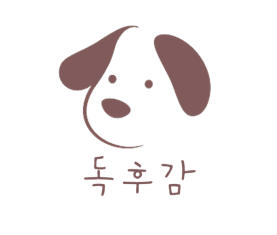

## 🧾목차

1. [**서비스 소개**](#-서비스-소개)
2. [**기술 스택**](#%EF%B8%8F-기술-스택)
3. [**시스템 아키텍처**](#-시스템-아키텍쳐)
4. [**주요 기능 영상**](#-주요기능-및-데모영상)
5. [**UCC 보러가기**](#-ucc-보러가기)
6. [**개발 멤버 소개**](#-개발-멤버-소개)
7. [**프로젝트 기간**](#-프로젝트-기간)

## ✨ 서비스 소개

#### 증가하고 있는 반려인구와 반려동물 관리의 필요성

> 매년 반려인구가 지속적으로 증가하며 이제 반려동물은 단순히 동물이 아닌 하나의 가족으로 자리잡고 있습니다.
>
> 하지만 우리의 비해 강아지의 평균 수명은 매우 짧습니다.
>
> 강아지와의 소중한 추억을 영원히 간직하고 더 효울적으로 강아지를 케어할 필요가 있습니다.

#### :dog2: 강아지 케어 플랫폼 독후감

#####  저희 독후감과 함께 우리의 가족인 강아지와의 영원한 추억, 산책, 건강 관리를 해보세요!

## 🛠️ 기술 스택
- 협업툴

- 서버관리

- 백앤드

- 프론트앤드

- 블록체인

## 🎛 시스템 아키텍쳐
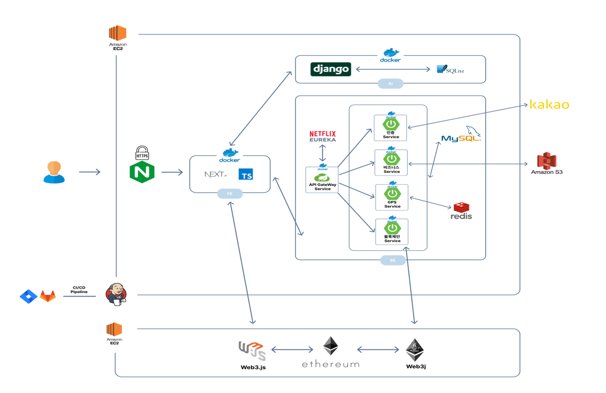

#### ERD
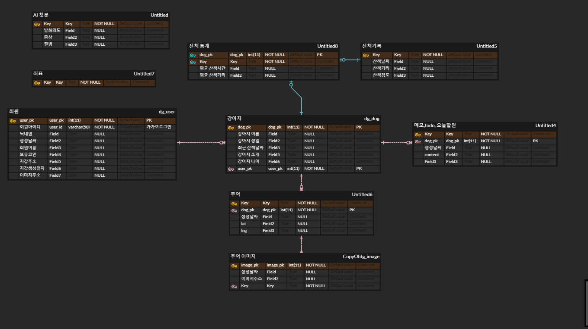

## 🐕 주요기능 및 데모영상
### 홈
*******************************************************************************
- 저희 서비스의 홈 화면입니다.
- 초기 이용자를 위해 각 서비스의 간단한 소개와 원하는 서비스로 바로 이동할 수 있게 하였습니다.
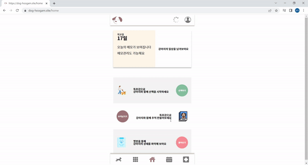
- 또한 오늘의 메모 목록을 보여주고 직접 관리도 가능하게 하였습니다.
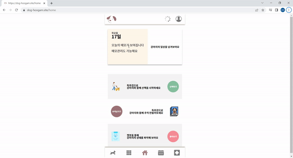

### 산책
*******************************************************************************
- 서비스의 메인 기능인 산책기능입니다.
- 초기 화면에서 같이 산책할 강아지를 선택하고 산책을 합니다.
- 산책을 하면서 이동 경로를 확인할 수 있고, 주변에 산책하고 있는 강아지를 확인 할 수 있습니다.
- 산책 중 과거에 발행 한 피드를 볼 수 있습니다.
- 모든 기능은 사용자 편의를 위해 필터로 키고 끄고를 가능하게 해 두었습니다.

### NFT
*******************************************************************************
- 마이페이지를 통해서 지갑 생성과 강아지 등록을 할 수 있습니다.

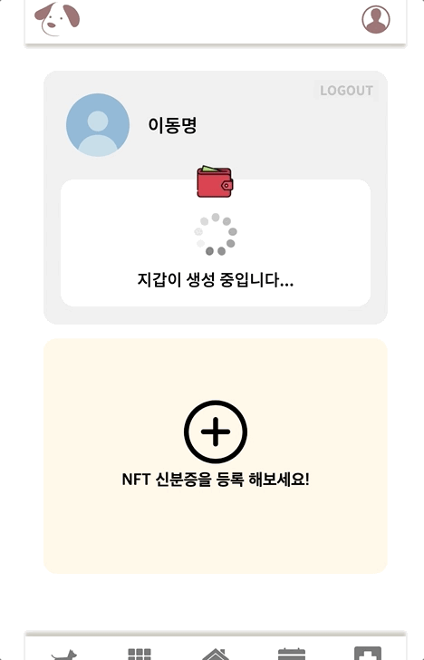
- 강아지 신분증은 ERC-721 규약을 지킨 NFT로 발행되며, 여러마리의 강아지가 등록이 가능합니다

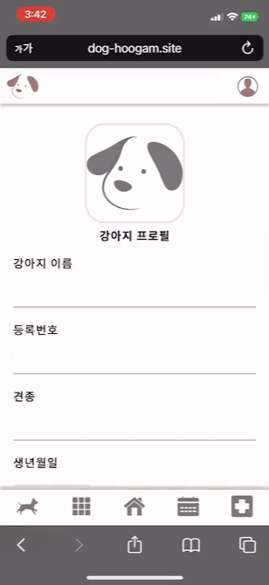

- 독후감 자체 코인인 INK 코인을 통해 피드 발행이 가능하며 해당 피드 또한 NFT로 발행됩니다.
- 피드 작성 시 강아지와 찍은 위치를 표시 할 수 있고 이후 산책 할 때 강아지와 남긴 사진들이 지도에 표시 됩니다.

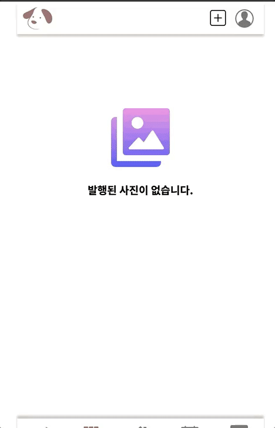
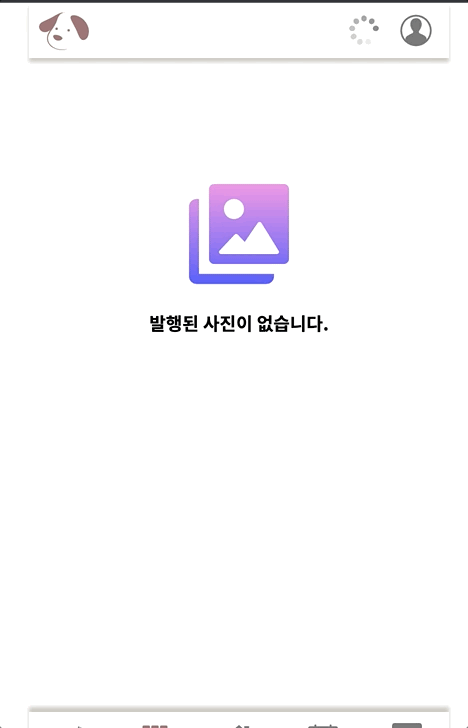

### 캘린더
*******************************************************************************
- 강아지와 관련된 간단한 메모를 작성하는 페이지입니다.
- 또한 메모 체크와 삭제 기능을 통해 사용자의 메모 관리를 도와줍니다.
  

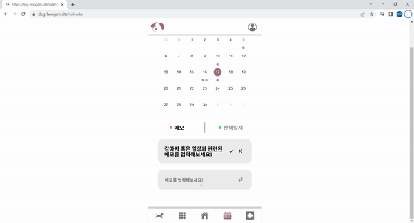
- 또한 캘린더에서 과거의 메모, 산책기록을 확인 할 수 있습니다.
  

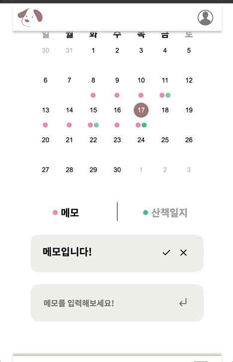

### 챗봇
*******************************************************************************
- 강아지의 현재 건강상태를 입력하면 그에 맞는 간편 진단을 도와주는 챗봇입니다.
- 사용자의 편의를 위해 여러개의 강아지 상태 박스가 아닌 문장단위로 입력을 받게 하였습니다.
- 문장에서의 발화 의도를 파악하기 위해 자연어처리를 하였습니다.
- 증상에 대한 질병의 대분류를 사용자가 선택하게 해줌으로써 진단의 정확성을 높였습니다.
- 결과적으로 예상되는 질병, 그 질병에 대한 증상, 예방법을 케러셀 형태로 보여줍니다.

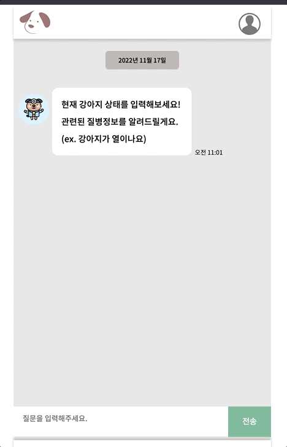

## 🎥 UCC 보러가기

## 🧑‍💻 개발 멤버 소개
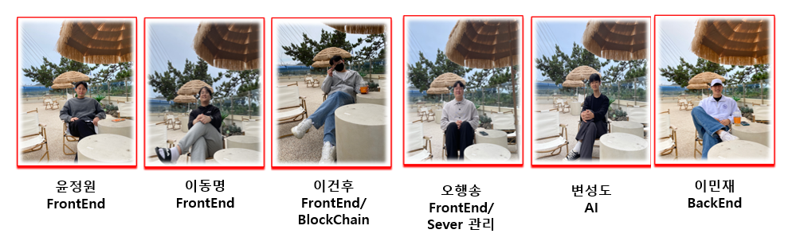

## ⌛ 프로젝트 기간

### 22.10.10 ~ 22.11.18

- 프로젝트 기획 : 22.10.10 ~ 22. 10. 17
- 설계 : 22.10.18 ~ 22.10.24
- 개발 : 22.10.25 ~ 22.11.11
- 버그 픽스 : 22.11.14 ~ 22.11.18

[**노션링크**](https://www.notion.so/Dog-9350dd6419074b59b125b62e2ed8ddd6)
